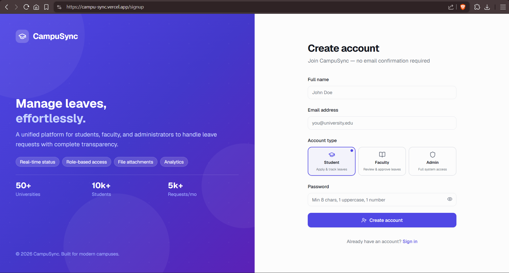
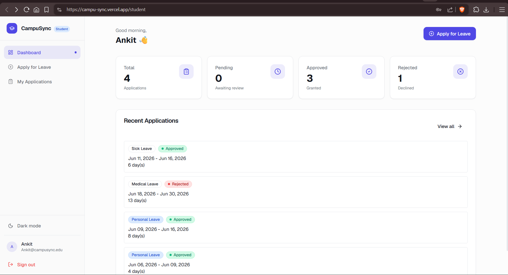
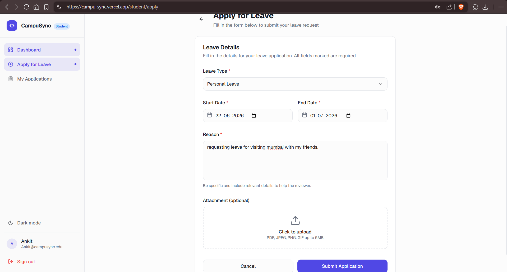
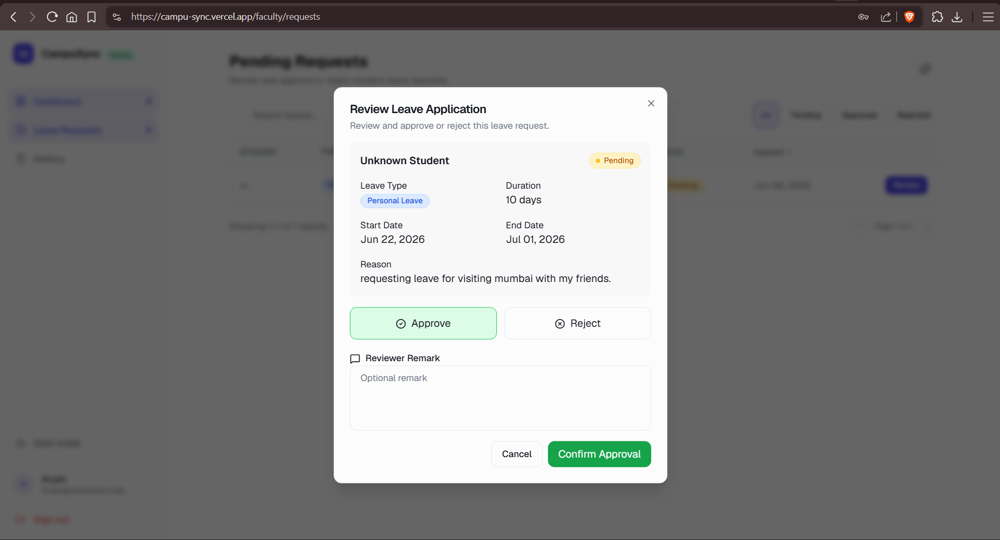
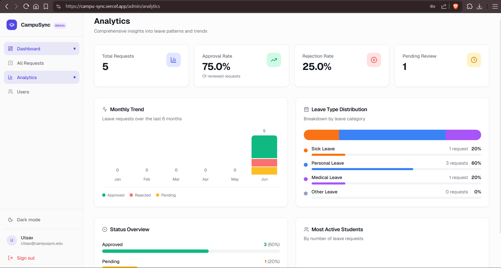

# 🎓 CampuSync — Campus Leave Management System

> **Live Demo:** [campu-sync.vercel.app](https://campu-sync.vercel.app)

A modern, production-ready campus leave management system built with Next.js 14, Supabase, TypeScript, and Tailwind CSS.

---

## 📸 Screenshots

### Login & Auth





### Student Dashboard





### Leave Application Form





### Faculty / Admin Review





### Analytics Dashboard





> **To add your screenshots:** Create a `screenshots/` folder in the repo root, take screenshots of each page, and save them with the filenames above. They'll render automatically here on GitHub.

---

## ✨ Features

- 🔐 Role-based auth — Student, Faculty, Admin via Supabase Auth
- 📋 Leave applications with file attachments (Supabase Storage)
- ✅ Approve/reject workflow with reviewer remarks
- 📊 Analytics dashboard with charts and breakdowns
- 🌙 Dark/light mode toggle
- 📱 Fully responsive mobile-first design

---

## 🛠 Tech Stack

| Layer | Tech |
|---|---|
| Framework | Next.js 14 (App Router) |
| Language | TypeScript |
| Styling | Tailwind CSS v3, Radix UI |
| Backend / DB | Supabase (Auth + Postgres + Storage) |
| Forms | React Hook Form + Zod |
| Tables | TanStack Table |
| Utilities | date-fns, Lucide Icons, Sonner |

---

## 🚀 Quick Start

### 1. Clone & install

```bash
git clone https://github.com/your-username/campusync.git
cd campusync
npm install
```

### 2. Set up Supabase

1. Go to [supabase.com](https://supabase.com) → Create new project
2. Open **SQL Editor** → paste contents of `supabase/migrations/001_initial_schema.sql` → Run
3. Go to **Project Settings → API** and copy your keys

### 3. Configure environment

```bash
cp .env.example .env.local
```

Fill in `.env.local`:
```env
NEXT_PUBLIC_SUPABASE_URL=https://your-project.supabase.co
NEXT_PUBLIC_SUPABASE_ANON_KEY=your-anon-key
SUPABASE_SERVICE_ROLE_KEY=your-service-role-key
```

### 4. Run dev server

```bash
npm run dev
```

Open [http://localhost:3000](http://localhost:3000)

---

## 👤 Test Accounts

Sign up at `/signup` and select any role (Student / Faculty / Admin) during registration.

> ⚠️ **For production:** Restrict role assignment to the database only:
> ```sql
> UPDATE profiles SET role = 'admin'   WHERE email = 'admin@example.com';
> UPDATE profiles SET role = 'faculty' WHERE email = 'faculty@example.com';
> ```

---

## 📁 Project Structure

```
campusync/
├── app/
│   ├── (auth)/login|signup         # Auth pages
│   ├── (dashboard)/
│   │   ├── student/                # Dashboard, apply, applications
│   │   ├── faculty/                # Dashboard, requests, history
│   │   └── admin/                  # Dashboard, requests, analytics, users
│   └── auth/callback/              # Supabase OAuth callback
├── components/
│   ├── ui/                         # Button, Card, Input, Dialog, etc.
│   ├── dashboard/                  # Sidebar, StatsCard, StatusBadge
│   ├── forms/                      # LeaveApplicationForm, ReviewLeaveDialog
│   └── tables/                     # LeavesTable (TanStack)
├── lib/
│   ├── supabase/client.ts          # Browser client
│   ├── supabase/server.ts          # Server client
│   ├── utils.ts                    # Helpers
│   └── validations.ts              # Zod schemas
├── types/index.ts
├── supabase/migrations/
│   └── 001_initial_schema.sql
└── middleware.ts                   # Route protection
```

---

## 🗃️ Database Schema

**`profiles`** — `id` (FK → auth.users), `email`, `full_name`, `role` (student | faculty | admin), `department`, `avatar_url`

**`leaves`** — `id`, `student_id` (FK), `leave_type` (sick | personal | medical | other), `start_date`, `end_date`, `reason`, `attachment_url`, `status` (pending | approved | rejected), `reviewed_by`, `reviewer_remark`, `reviewed_at`

RLS policies ensure students only see their own records; faculty and admins see all.

---

## 🚀 Deploy to Vercel

[


](https://vercel.com/new/clone?repository-url=https://github.com/your-username/campusync)

Or deploy manually:

```bash
vercel
```

Then add your three environment variables in the Vercel dashboard under **Settings → Environment Variables**.

---

## 📄 License

MIT © [Ankit](https://github.com/mark392a-ux)
